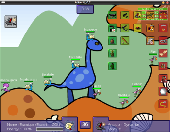

.. _old-projects:

++++++++++++++++++++++++
Old Projects (2000-2009)
++++++++++++++++++++++++

.. seealso::
   My :ref:`current projects <projects>` and my :ref:`talks <talks>`.

Websites
========

- `Wiki <http://www.haypocalc.com/wiki/>`_ (last new article in december 2013).
  haypocalc.com domain created in december 2001.
- `Blog Haypo <http://www.haypocalc.com/blog/>`_ (last article in 2011)
- `Wordpress Blog <http://www.haypocalc.com/wordpress/>`_ (last article in 2011)
- `La page de Haypo <http://haypo.developpez.com/>`_ (2005)
- `Turbo Pascal <http://turbo-pascal.developpez.com/>`_ (2004)

Articles on linuxfr.org
=======================

Some of my articles:

* `Python 3.4 est sorti avec 7 nouveaux modules
  <http://linuxfr.org/news/python-3-4-est-sorti-avec-7-nouveaux-modules>`_ (2014/03)
* `Justice Free publie enfin ses patchs sur les logiciels libres
  <http://linuxfr.org/news/free-publie-enfin-ses-patchs-sur-les-logiciels-libres>`_ (2011/09)
* `Python 3.2
  <http://linuxfr.org/news/python-32>`_ (2011/02)
* `Patch pour le noyau Linux améliorant l'interactivité entre les applications console et Xorg
  <http://linuxfr.org/news/patch-pour-le-noyau-linux-am%C3%A9liorant-linteractivit%C3%A9-entre-les-a>`_ (2010/11)
* `Python 2.7
  <http://linuxfr.org/news/python-27>`_ (2010/07)
* `Sortie de la version 2.11 de la bibliothèque standard C GNU (glibc)
  <http://linuxfr.org/news/sortie-de-la-version-211-de-la-biblioth%C3%A8que-standard-c-gnu-gli>`_ (2009/11)
* `Intel ne maintient plus le pilote Linux Poulsbo depuis un an et demi
  <http://linuxfr.org/news/intel-ne-maintient-plus-le-pilote-linux-poulsbo-depuis-un-an-et>`_ (2009/10)
* `Python arrive en version 3.1
  <http://linuxfr.org/news/python-arrive-en-version-31--2>`_ (2009/07)
* `Debian remplace la glibc par eglibc
  <http://linuxfr.org/news/debian-remplace-la-glibc-par-eglibc--2>`_ (2009/05)
* `Nouvelle version majeure de Python (2.6)
  <http://linuxfr.org/news/nouvelle-version-majeure-de-python-26>`_ (2008/10)

Paper Articles
==============

* `Netfilter et le filtrage du protocole IPv6
  <http://www.unixgarden.com/index.php/gnu-linux-magazine-hs/netfilter-et-le-filtrage-du-protocole-ipv6>`_
  (french): GNU/Linux Magazine HS 41 (April 2009)

* `Hors-série Linux Mag : Explorez les richesses du langage Python
  <http://www.haypocalc.com/blog/index.php/2009/01/27/185-hors-serie-linux-mag-explorez-les-richesses-du-langage-python>`_
  (january/february 2009).
  I wrote 4 articles:

  - Nouveautés de Python 2.6
  - Nouveautés de Python 3.0
  - Trucs et astuces
  - Ctypes et Python

* "Pratique du fuzzing avec Fusil" (french), MISC magazine n°39 (september 2008)

* "Comment réaliser un fuzzer ?" (french), MISC magazine n°36 (march 2008)

  - http://www.haypocalc.com/blog/index.php/2008/03/10/136-comment-raliser-un-fuzzer

Python projects
===============

* `astoptimizer <https://bitbucket.org/haypo/astoptimizer>`_: experimental
  optimizer for Python code working on the Abstract Syntax Tree (AST,
  high-level representration). It does as much work as possible at compile
  time.
* `Fusil <http://fusil.readthedocs.org/>`_: Fusil is a Python library used
  to write fuzzing programs. It includes fuzzers for Firefox, ClamAV, Mplayer,
  Python, etc. I am no more working actively on the project, but it still
  works.
* `pysandbox <https://github.com/vstinner/pysandbox>`_: Sandbox to run untrusted
  Python code. Project stopped because it is broken by design.
* `python-ipy <https://github.com/vstinner/python-ipy>`_: Python classes and tools
  for handling of IPv4 and IPv6 addresses and networks. I don't need this
  module anymore and so I am no more interested to maintain it, the new
  maintainer is Jeff Ferland aka autocracy. Python 3.3 now includes `ipaddress
  <http://docs.python.org/3/library/ipaddress.html>`_, a concurrent module to
  handle IP addresses and networks.
* `registervm <http://hg.python.org/sandbox/registervm>`_: My fork of Python
  3.3 using register-based bytecode, instead of stack-code bytecode. Read
  `REGISTERVM.txt <http://hg.python.org/sandbox/registervm/file/tip/REGISTERVM.txt>`_
* `python-ptrace <http://python-ptrace.readthedocs.org/>`_: Python binding
  of ptrace library to debug processes on UNIX and BSD.

Other projects
==============

* `Trollius <http://trollius.readthedocs.org/>`_:  portage of the Tulip
  project (asyncio module, PEP 3156) on Python 2, asynchronous input/output
  library.
* `Hachoir3 <http://hachoir3.readthedocs.io/>`_: Python library that allows
  to view and edit a binary stream field by field. In other words, Hachoir
  allows you to "browse" any binary stream just like you browse directories and
  files. A file is split in a tree of fields, where the smallest field is just
  one bit.
* `Warmux <http://fr.wikipedia.org/wiki/Warmux>`_, previously known as "Wormux":
  Open source clone of the famous 2D game "Worms" by Team17.

Old removed projects
====================

* Hasard: pseudo-random number generator (PRNG) library.
* aioeventlet: implementation of the asyncio API (PEP 3156) on top of eventlet.
* aiogevent: implementation of the asyncio API (PEP 3156) on top of gevent.
* macfly: tool allowing to run one or more programs with a shifted clock
  compared to system clock. project written at INL for the french CNES
  (National Centre for Space Studies)
* HaypoCALC: A formal calculator in text terminal. Existing functions : ln,lg,
  basen, gcd, lcm, ncr, npr, factor(int), cos,sin,tan, acos,asin,atan,
  derive,taylor, ... Work on Linux and Windows, programmed in C++.
* happyboom: Prototype of a library to write a turn-based game, it is mostly a
  network protocol.

Workshops Lolut
===============

Dans le cadre du `club Lolut <http://lolut.utbm.info/>`_ auquel j'appartiens,
j'ai organisé plusieurs ateliers :

* En cours de préparation : Ateliers sécurité durant le semestre 2005/2006 (cf.
  `ateliers automne 2005 <http://lolut.utbm.info/wiki/index.php/AteliersA2005>`_)
* `Atelier sécurité - Introduction générale et failles avec le langage C
  <http://lolut.utbm.info/2005-10-Ateliers-Secu>`_ (6 octobre 2005) : Compte
  rendu, présentation, exercices et liens sont disponibles.
* `Atelier création de sites web avec XML/XSL/CSS
  <http://lolut.utbm.info/index.php?article=2004-04-08-atelier-xml>`_ (08 avril
  2004)
* `Compte rendu atelier Gimp
  <http://lolut.utbm.info/index.php?article=2004-03-25-atelier-gimp>`_
  (25 mars 2004)
* ''Programmation C/C++ sous Linux'' (18 avril 2002) : pas de compte rendu
  malheureusement.
* ''Atelier PHP'' (9 janvier 2003), pas de compte rendu, mais `les documents
  sont disponibles
  <http://lolut.utbm.info/pub/2003-01-09-php/documentation.htm>`_ ainsi que les
  `exemples <http://lolut.utbm.info/pub/2003-01-09-php/atelier_php.tar.gz>`_.
  Je l'ai organisé avec [[Damien Boucard]] et Laurent Adda (ce dernier a quitté
  l'UTBM la même année ...).

"Childhood"
===========

I like programming. I started with examples copy-pasted manually from the
magazine "Science & Vie Junior", programs written in "Basic" (Microsoft Quick
Basic).

Then I moved forward with the programming language "Pascal" (avec Turbo Pascal
7), completed with assembler Intel x86  (Borland Turbo Assembleur 1 and 2).

The other major change was the move to the object oriented programming (OOP)
with Borland C++ Builder and short tests with gcc on MS-DOS (it didn't work
well). When I started to study at UTBM (engineer school), I switched
from Windows to Linux because the 4 computers running Linux were
always available and I didn't thave the Internet at home.

I learnt HTML and XHTML (completed with Javascript), then PHP, and finally XML
+ XSLT + CSS. I learnt some Java at school, and Python at home.

I also developed with Visual Basic and Delphi, but I didn't do anything
interesting with them.

